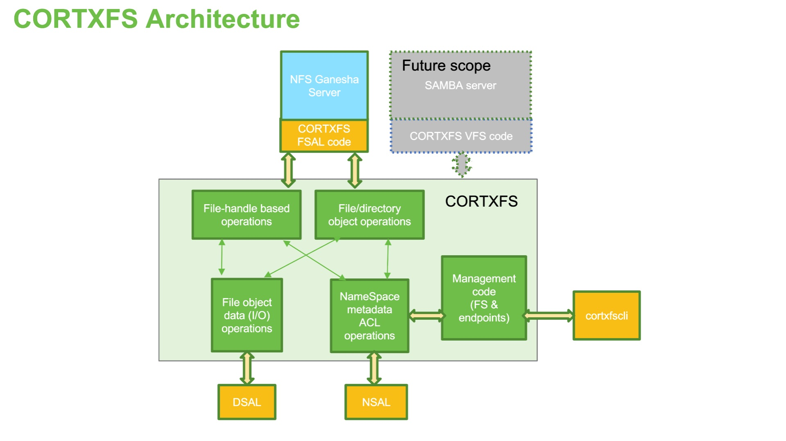

# CORTXFS Quick Start Guide

CORTXFS provides file system infrastructure over clustered object store.
This file system infrastructure provides a subset of POSIX file system APIs so
that it is suitable for file access protocols like NFS, CIFS.
CORTXFS interacts with NSAL and DSAL libraries to provide file system like
infrastructure.

### Architectural overview

NSAL (Name Space Abstraction Layer) provides a way to create a global name
space, which can be accessed from any node in the clustered object store.
[Know more about NSAL](https://github.com/Seagate/cortx-nsal)

CORTXFS makes use of NSAL to create file system and export information (a.k.a.
endpoint). The directory structure is represented as kvtree in NSAL. Every
file, directory and symlink is represented via kvnode in NSAL. Kvnode stores
the metadata about the object it represents, just like inode. Every file in
CORTXFS is uniquely identified by a 128 bit object id and a corresponding DSAL
object is created on the backend store to store the file data. For a directory,
no backend DSAL object is created.

DSAL (Data Store Abstraction Layer) provides a way to write, read and
modify the file data, from any node in the clustered object store. 
[Know more about DSAL](https://github.com/Seagate/cortx-dsal)

CORTXFS code makes use of [cortx-utils]() for various functionalities like
logging, unit test infrastructure.

### Code structure
CORTXFS provides 2 major ways to deal with underneath file/directory objects.
There are functions which works with those objects directly.
There is another set of functions which works on those objects via file-handle.
This set of functions are more useful for NFS protocol.

